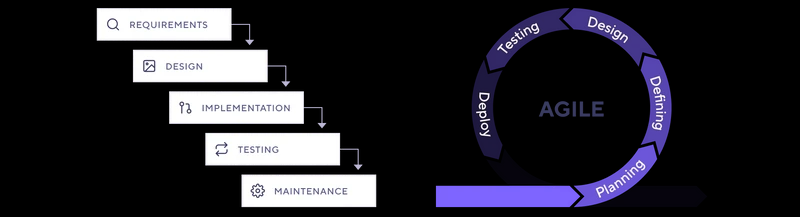
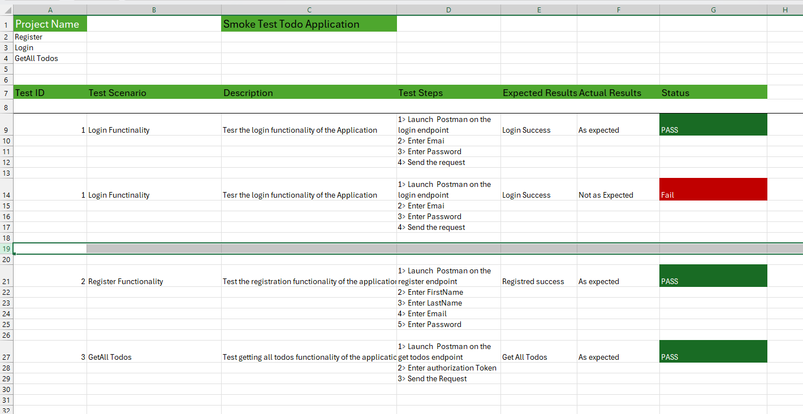
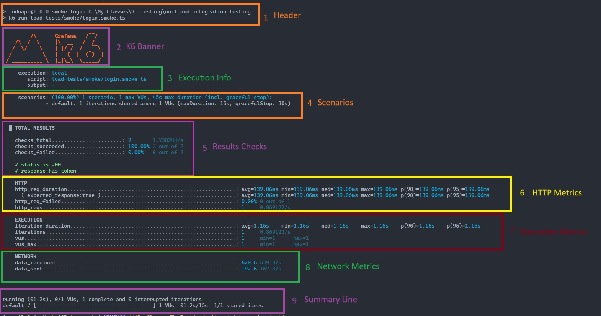

# Perfomance Testing

**Performance testing** is a type of software testing that evaluates how an application behaves under various levels of load, stress, or demand. It measures responsiveness, stability, scalability, and resource usage to ensure the system meets performance requirements.

**Why do we need performance testing?**

* **Identify bottlenecks:** Find slow parts of your system before users do.
* **Ensure reliability:** Confirm the application remains stable under expected and peak loads.
* **Validate scalability:** Check if the system can handle growth in users or data.
* **Meet SLAs:** Ensure response times and throughput meet business or contractual requirements.
* **Improve user experience:** Fast, stable applications keep users satisfied.

## Documenting Smoke Testing

## Perfomance Testing with K6

### Understand the K6 test ouptut

**Header**

* Shows the script and command being run.

**K6 Banner**

* k6 logo and branding

**Execution info**

* **execution:** Test is running locally.
* **script:** Path to your test script.
* **output:** No external output (just console).

**Scenarios**

* **1 scenario:** Only one test scenario is running.
* **1 max VUs:** Only 1 virtual user (VU) is used.
* **1 iteration:** The test runs once.
* **maxDuration:** 15 seconds for the test, 30 seconds for graceful stop.

**Checks**

* **checks_total:** 2 checks were performed (as defined in your script).
* **checks_succeeded:** 100% passed (both checks).
* **checks_failed:** 0% failed.
* The two checks: HTTP status is 200, and the response has a token.

**HTTP Metrics**

* **http_req_duration:** The request took ~139ms.
* **http_req_failed:** 0% failed (all requests succeeded).
* **http_reqs:** 1 HTTP request was made.

**Execution Metrics**

* **iteration_duration:** The whole test iteration took ~1.15 seconds.
* **iterations:** 1 iteration completed.
* **vus:** 1 virtual user was used.

**Network Metrics**

* **data_received:** 620 bytes received.
* **data_sent:** 192 bytes sent.

**Summary Lines**

* The test ran for 1.2 seconds, completed 1 iteration, and finished successfully.

### **Header**
